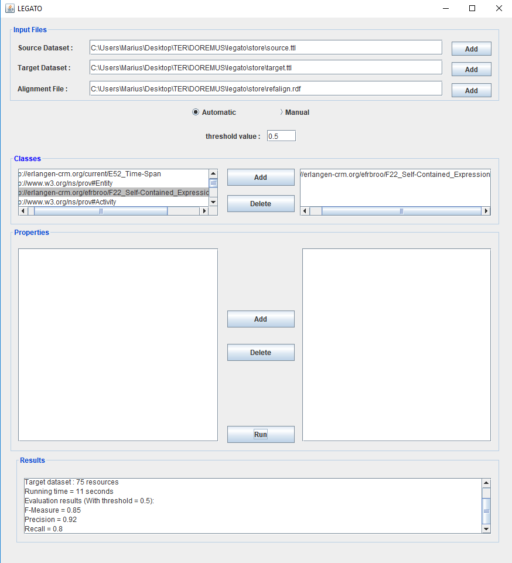

# <b> <i> Legato </i> : Disambiguating and Linking Heterogeneous Resources Across RDF Graphs </b>

An automatic data linking tool developed by [DOREMUS][3].

<b> About <i> Legato </i> </b>
========
<b> <i> Legato </i> </b> is based on the following steps:
1. **Data cleaning**: A preprocessing step allowing the instances to be more easily comparable.
2. **Instance profiling**: based on Concise Bounded Description (CBD) to represent each instance by an excerpt of its description considered relevant for the entity comparison task.
3. **Indexing**: We apply standard NLP techniques to index the instance profiles by using a term frequency vector model.
4. **Link repairing**: A post-processing step to repair erroneous links generated in the matching step by clustering highly similar instances together. We use RANKey to distinguish between such instances.

<b> How to run <i> Legato </i> </b>
========
For running <b> <i> Legato </i> </b> through the GUI, please run the "main.java" class in the "legato" package. Then, select the source, target and alignement (if it is availble) files. Then, you can choose between two treatment's modes :
- Automatic allows to filter resources and comparate by some classes.
- Manual allows to filter resources and comparate by classes and properties.
When you have chosen the mode and features for filter, click on "run" for aligning and evaluating the produced links. If no alignement file exists, <b> <i> Legato </i> </b> matches the instances without evaluating the produced links.

Benchmark datasets: [DOREMUS data][1] (real musical data)

The figure, below, illustrates <b> <i> Legato </i> </b>  running on [FPT data][2] :

<b> Requirements </b>
========
JDK 8 or later

[1]: https://github.com/DOREMUS-ANR/doremus-playground

[2]: https://github.com/DOREMUS-ANR/doremus-playground/tree/master/DS_FP

[3]: http://www.doremus.org/
